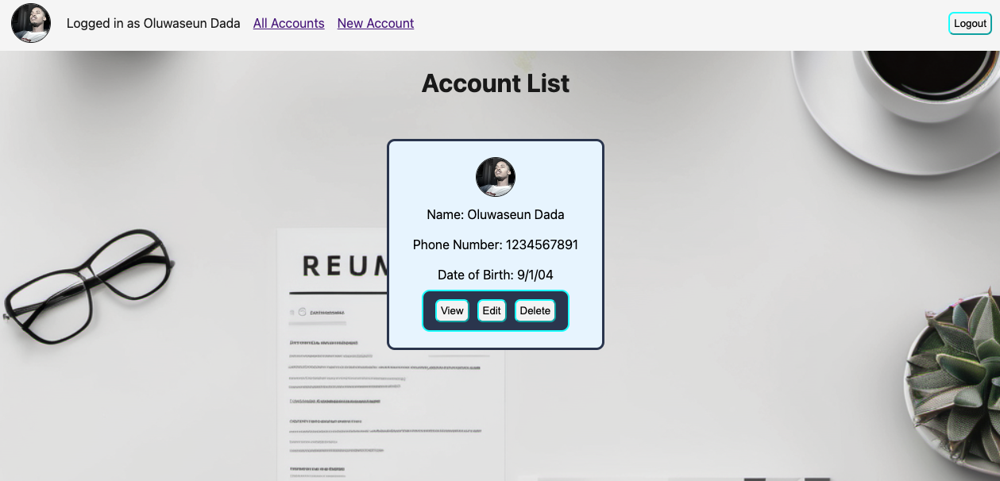

# `Resfolio` 
***

## [Deploy Resfolio here](https://resfolio.fly.dev)📄
#### `Description` 📝
***
#### Resfolio is

## [Resfolio Planning Doc](https://docs.google.com/document/d/1mUVz_zz4NqaR34Sl9zEqurpi_000LOe71DqWH0EL_vM/edit)⬅

## [Trello Planning](https://trello.com/b/R2VCddfo/resfolio)

## `Technologies used` 🖥

- HTML
- CSS
- MongoDB
- JavaScript
- Whimsical (if you used it)
- Trello
- Fly.io
- Google OAuth
- Express
- Node
- Passport.js
- Git
- Github

## `Attributions` ❖

- I got my Favicon from [here](https://www.favicon.cc/)
- I got my Icons from [Font Awesome](https://fontawesome.com/)
- Animations from [Animate.css](https://animate.style/)

## `Ice Box` ❄️

- [x] A drop down menu to take you to different routes in place of the navigation bar
- Search bar for job title
- Resume url input in form to upload resume document
- Display application list and the application details o the same page.
- If school finished Boolean is clicked display end year input