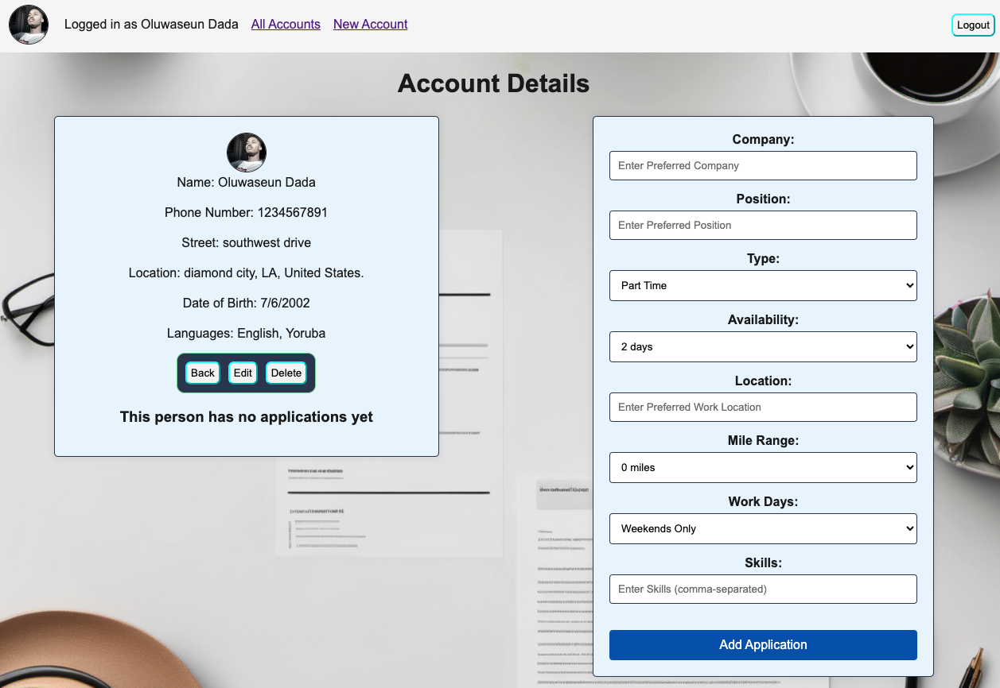

# `Resfolio`
***

## [Try out Resfolio here](https://resfolio.fly.dev)⬅

#### `Description` 📝
***
#### Resfolio is an app where people can create accounts which display applications to potential companies under many job positions. Create in applications in seconds, have employers search for you not just the other way around, and find success!

## [Resfolio Planning Doc](https://docs.google.com/document/d/1mUVz_zz4NqaR34Sl9zEqurpi_000LOe71DqWH0EL_vM/edit)

## [Trello Planning](https://trello.com/b/R2VCddfo/resfolio)

## `Technologies used` 🖥

- HTML
- CSS
- MongoDB
- JavaScript
- Whimsical
- Trello
- Fly.io
- Google OAuth
- Express
- Node
- Passport.js
- Git
- Github

## `Attributions` ❖

- I got my Favicon from [here](https://www.favicon.cc/)
- Animations from [Animate.css](https://animate.style/)

## `Ice Box` ❄️

- A drop down menu to take you to different routes in place of the navigation bar.
- Search bar for job title.
- Resume url input in form to upload resume document.
- [x] Display applications list with 4 in a row.
- Add Education schema.